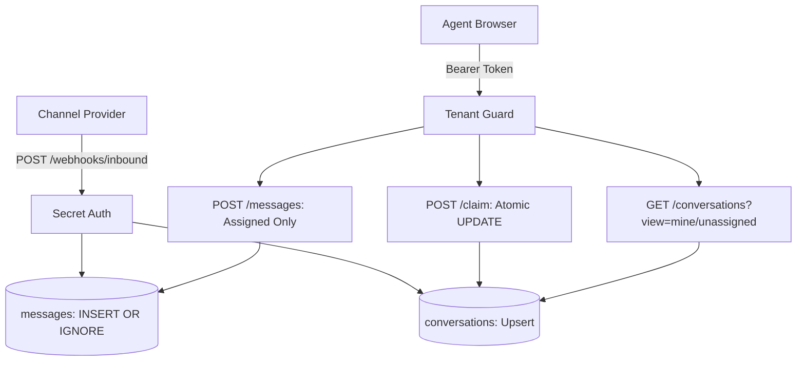

# Yellow.ai Agent Inbox

A multi-tenant support agent inbox with idempotent webhook ingestion, race-condition-safe claiming, and real-time polling.

---

### Architecture



---

### Quick Start (Single Command)

Run the all-in-one startup script (creates `.venv`, installs dependencies, seeds SQLite database, and boots backend + UI):

```powershell
.\start.ps1
```

> **Live Dashboard**: Open **http://127.0.0.1:8000** in your browser.  
> Switch between agents using the top-right dropdown:
> * **Acme**: Alice (`token_acme_1`), Bob (`token_acme_2`)
> * **Globex**: Charlie (`token_globex_1`), Dana (`token_globex_2`)

---

### Live Demo: "Catch & Claim" (Simulated Stream)

While the server is running, open a second terminal and trigger the 60-second real-time simulation:

```powershell
.\.venv\Scripts\python simulate_inbound.py
```

* Streams **12 customer conversations** over **60 seconds** (~5s interval).
* Watch tickets pop into the UI without page reloads.
* Open two browser tabs (Alice vs Bob) to test claiming live conversations concurrently.

---

### Quick Test (Automated Verification)

Run the formal verification test suite:

```powershell
.\.venv\Scripts\python test_suite.py
```

| Test Case | What it Proves |
| :--- | :--- |
| `test_webhook_deduplication` | Duplicate `message_id` returns `200` (`deduplicated=True`) and stores exactly 1 row. |
| `test_tenant_isolation` | Acme agents querying Globex resources receive `404 Not Found`. |
| `test_concurrent_claims` | Simultaneous claims yield exactly one `200` (winner) and one `409 Conflict` (loser). |
| `test_reply_authorization` | Assigned agent gets `201`; non-assignee gets `403 Forbidden`. |
| `test_chronological_ordering` | Messages return strictly in order of customer `sent_at ASC`. |

---

### API Endpoints

| Method | Endpoint | Header | Purpose |
| :--- | :--- | :--- | :--- |
| `POST` | `/webhooks/inbound` | `X-Webhook-Secret: whsec_yellow_test_secret` | Ingests customer message (`201` new / `200` duplicate). |
| `GET` | `/conversations?view=unassigned\|mine` | `Authorization: Bearer <token>` | Scoped queue list with waiting duration. |
| `GET` | `/conversations/:id` | `Authorization: Bearer <token>` | Thread messages ordered chronologically (`404` cross-tenant). |
| `POST` | `/conversations/:id/claim` | `Authorization: Bearer <token>` | Atomic claim lock (`200` win / `409` conflict). |
| `POST` | `/conversations/:id/messages` | `Authorization: Bearer <token>` | Outbound reply (`201` assigned / `403` unassigned). |

---

### How You'd Tell It's Broken

1. **Automated Suite**: `python test_suite.py` fails any of the 5 race/dedup/isolation assertions.
2. **UI Banners**: 
   * Attempting to claim a ticket someone else took displays a red conflict alert naming the winner.
   * Reply input stays disabled if the conversation is not assigned to you.
3. **Database Health Checks** (`sqlite3 agent_inbox.db`):
   * **Deduplication Check** (should return 0 rows):
     ```sql
     SELECT id, COUNT(*) FROM messages GROUP BY id HAVING COUNT(*) > 1;
     ```
   * **Tenant Isolation Check** (should return 0 rows):
     ```sql
     SELECT c.id FROM conversations c JOIN messages m ON c.id = m.conversation_id 
     WHERE c.workspace_id != m.workspace_id;
     ```
