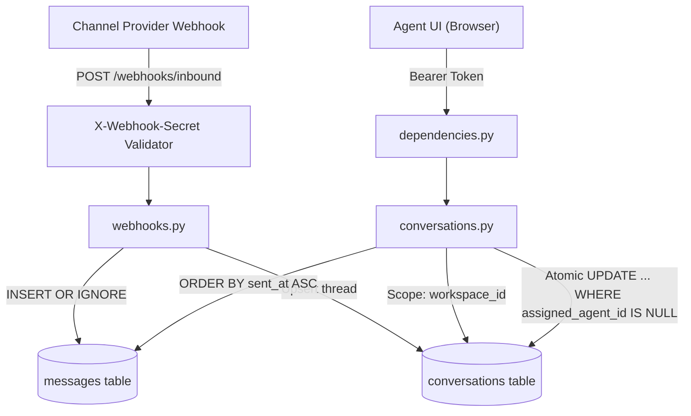

# Yellow.ai Agent Inbox

A stripped-down, multi-tenant customer support inbox featuring idempotent webhook ingestion and atomic conversation claiming.

---

### Architecture



---

### Quick Start

1. **Activate Virtual Environment & Install Dependencies**:
   ```powershell
   python -m venv .venv
   .\.venv\Scripts\pip install -r requirements.txt
   ```

2. **Seed Database**:
   ```powershell
   .\.venv\Scripts\python seed.py
   ```
   * Seeds 2 workspaces (`acme`, `globex`).
   * Seeds 4 agents with static tokens:
     * `token_acme_1` (Alice - Acme)
     * `token_acme_2` (Bob - Acme)
     * `token_globex_1` (Charlie - Globex)
     * `token_globex_2` (Dana - Globex)

3. **Start the Server**:
   ```powershell
   .\.venv\Scripts\python -m uvicorn main:app --reload
   ```
   Open **http://127.0.0.1:8000** in your browser to view the live dashboard.

---

### Quick Test

Run the automated verification suite:
```powershell
.\.venv\Scripts\python test_suite.py
```

#### Included Test Cases:
1. `test_webhook_deduplication`: Confirms duplicate `message_id` retries return `200 OK` (`deduplicated=True`) and store exactly 1 row.
2. `test_tenant_isolation`: Confirms Acme agents get `404 Not Found` for Globex resources.
3. `test_concurrent_claims`: Fires two simultaneous claim threads at the exact same millisecond; verifies exactly one returns `200` and the other returns `409 Conflict` naming the winner.
4. `test_reply_authorization`: Confirms only the assigned agent can reply (`201`), rejecting other agents with `403 Forbidden`.
5. `test_chronological_ordering`: Confirms messages return sorted by `sent_at ASC`.

---

### API Endpoints

| Method | Endpoint | Headers | Description |
| :--- | :--- | :--- | :--- |
| `POST` | `/webhooks/inbound` | `X-Webhook-Secret: whsec_yellow_test_secret` | Ingests customer message. Creates conversation as unassigned. Deduplicates on `message_id`. |
| `GET` | `/conversations?view=unassigned\|mine` | `Authorization: Bearer <token>` | Lists queue conversations scoped to the agent's workspace. |
| `GET` | `/conversations/:id` | `Authorization: Bearer <token>` | Returns thread messages in chronological order (`sent_at ASC`). Returns 404 for other tenants. |
| `POST` | `/conversations/:id/claim` | `Authorization: Bearer <token>` | Atomically claims an unassigned ticket. Returns 200 on success, 409 on conflict. |
| `POST` | `/conversations/:id/messages` | `Authorization: Bearer <token>` | Sends an agent reply. Returns 201 for assigned agent, 403 otherwise. |

---

### Test Inbound Webhook

Simulate a new inbound WhatsApp/web chat message:

```powershell
curl -X POST "http://127.0.0.1:8000/webhooks/inbound" `
  -H "Content-Type: application/json" `
  -H "X-Webhook-Secret: whsec_yellow_test_secret" `
  -d '{
    "workspace": "acme",
    "conversation_id": "conv_demo_1",
    "message_id": "msg_demo_101",
    "customer_name": "Elon Musk",
    "text": "Hello, need assistance with my order.",
    "sent_at": "2026-10-09T14:30:00Z"
  }'
```
*(The message appears in the UI instantly via the 2-second polling loop without page reload).*
