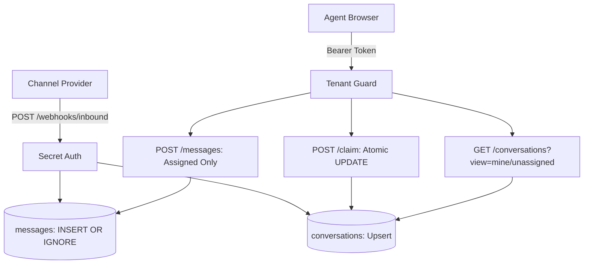

# Yellow.ai Agent Inbox

A multi-tenant support agent inbox with idempotent webhook ingestion and race-condition-safe claiming.

---

### Architecture



---

### Quick Start

Run the all-in-one startup script (creates venv, installs dependencies, seeds database, and boots backend + UI):

```powershell
.\start.ps1
```

> **Live UI**: Open **http://127.0.0.1:8000** in your browser.  
> Switch between agents (**Alice / Bob** for Acme, **Charlie / Dana** for Globex) using the top-right dropdown.

---

### Quick Test

Run the 5-proof verification suite:

```powershell
.\.venv\Scripts\python test_suite.py
```

* `test_webhook_deduplication` $\rightarrow$ Duplicate `message_id` returns `200` (`deduplicated=True`) and stores exactly 1 row.
* `test_tenant_isolation` $\rightarrow$ Cross-tenant access returns `404 Not Found`.
* `test_concurrent_claims` $\rightarrow$ Simultaneous claims yield exactly one `200` (winner) and one `409 Conflict` (loser).
* `test_reply_authorization` $\rightarrow$ Assigned agent gets `201`; other agent gets `403 Forbidden`.
* `test_chronological_ordering` $\rightarrow$ Messages sorted strictly by `sent_at ASC`.

---

### API Endpoints

| Method | Endpoint | Header | Purpose |
| :--- | :--- | :--- | :--- |
| `POST` | `/webhooks/inbound` | `X-Webhook-Secret: whsec_yellow_test_secret` | Ingest customer message (`201` new / `200` duplicate). |
| `GET` | `/conversations?view=unassigned\|mine` | `Authorization: Bearer <token>` | Scoped queue list with waiting time. |
| `GET` | `/conversations/:id` | `Authorization: Bearer <token>` | Thread messages ordered by `sent_at` (`404` cross-tenant). |
| `POST` | `/conversations/:id/claim` | `Authorization: Bearer <token>` | Atomic claim (`200` win / `409` conflict). |
| `POST` | `/conversations/:id/messages` | `Authorization: Bearer <token>` | Outbound reply (`201` assigned / `403` unassigned). |

---

### Test Inbound Webhook

Simulate an incoming WhatsApp/chat message (will pop up in UI within 2s without page reload):

```powershell
curl -X POST "http://127.0.0.1:8000/webhooks/inbound" `
  -H "Content-Type: application/json" `
  -H "X-Webhook-Secret: whsec_yellow_test_secret" `
  -d '{
    "workspace": "acme",
    "conversation_id": "conv_demo_1",
    "message_id": "msg_demo_101",
    "customer_name": "Elon Musk",
    "text": "Where is my order?",
    "sent_at": "2026-10-09T14:30:00Z"
  }'
```

---

### How You'd Tell It's Broken

1. **Test Suite Failure**: `python test_suite.py` fails on any concurrency, duplicate, or isolation assertion.
2. **HTTP 409 Spikes**: Legitimate claims failing repeatedly indicating race-condition contention or lock staleness.
3. **Database Leaks**: Cross-tenant query returning anything other than `404`.
